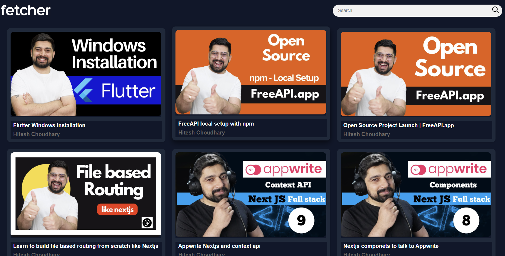

# Fetcher

## Overview
Fetcher allows users to browse and search through videos fetched from a public YouTube API. This project demonstrates the implementation of a fetching videos from API and showing it in website with search functionality, similar to YouTube's homepage.



## Features
- **Video Browsing**: Display videos in a responsive grid layout
- **Search Functionality**: Filter videos by title
- **Responsive Design**: Works on desktop, tablet, and mobile devices
- **Video Information**: Shows video thumnails, title and  channel name
- **External Links**: Clicking on videos opens the original YouTube video in a new tab

## Technologies Used
- HTML5
- CSS3 
- JavaScript
- Fetch API for data retrieval

## Project Structure
```
├── index.html        # Main HTML file
├── styles.css        # CSS styles
├── index.js          # JavaScript functionality
└── README.md         # Project documentation
```

## Setup and Installation
1. Clone the repository:
   https://github.com/Amarsah15/Chai-Code-Cohort-Project.git

2. Open the project:
   - Use a local server (like Live Server extension in VS Code)
   - Or simply open the `index.html` file in your browser

## API Usage
This project uses the free API from freeapi.app:
```
https://api.freeapi.app/api/v1/public/youtube/videos

```
For more details, check the API documentation: [FreeAPI Guide](https://freeapi.hashnode.space/api-guide/apireference/getYoutubeVideos)

## How to Use
1. When you open the website, it automatically loads videos from the API
2. Use the search bar at the top to filter videos by title
3. Click on any video thumbnail to open the original YouTube video

## Deployment

You can access the live version of the application here:

[Live Demo](https://chai-code-cohort-project.vercel.app/)

## Credits
- YouTube API provided by [freeapi.app](https://freeapi.app)
- Icons and design inspiration from YouTube